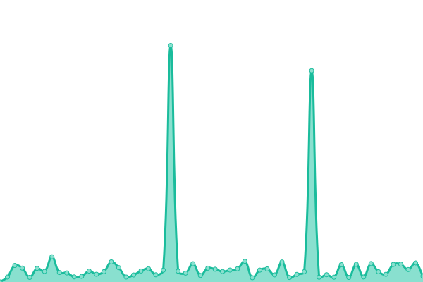
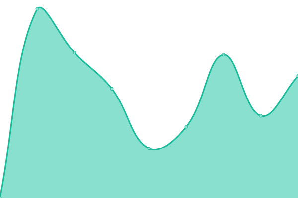
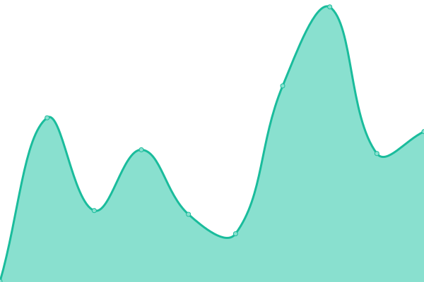

# [📈 Live Status](https://demo.upptime.js.org): <!--live status--> **🟩 All systems operational**

This repository contains the open-source uptime monitor and status page for [Sumit S. Chaure](https://github.com/Sumit-SC), powered by [Upptime](https://github.com/upptime/upptime).

With [Upptime](https://upptime.js.org), you can get your own unlimited and free uptime monitor and status page, powered entirely by a GitHub repository. We use [Issues](https://docs.github.com/en/issues) as [Incident Reports](https://github.com/Sumit-SC/uptime-webapp/issues), [Actions](https://docs.github.com/en/actions) as [Uptime Monitors](https://github.com/Sumit-SC/uptime-webapp/actions), and [Pages](https://pages.github.com/) for the [Status Page](https://demo.upptime.js.org).

<!--start: status pages-->
<!-- This summary is generated by Upptime (https://github.com/upptime/upptime) -->
<!-- Do not edit this manually, your changes will be overwritten -->
<!-- prettier-ignore -->
| URL | Status | History | Response Time | Uptime |
| --- | ------ | ------- | ------------- | ------ |
|  [Portfolio Page](https://sumit-sc.github.io) | 🟩 Up | [portfolio-page.yml](https://github.com/Sumit-SC/ping/commits/HEAD/history/portfolio-page.yml) | 

 489ms
     
 | 

<a href="https://status.sumit.indevs.in/history/portfolio-page">100.00%</a>
    

|  [Personal-Lab](http://www.colab.indevs.in) | 🟩 Up | [personal-lab.yml](https://github.com/Sumit-SC/ping/commits/HEAD/history/personal-lab.yml) | 

 220ms
     
 | 

<a href="https://status.sumit.indevs.in/history/personal-lab">100.00%</a>
    

|  [Portfolio Website](https://www.sumit.indevs.in) | 🟩 Up | [portfolio-website.yml](https://github.com/Sumit-SC/ping/commits/HEAD/history/portfolio-website.yml) | 

 215ms
     
 | 

<a href="https://status.sumit.indevs.in/history/portfolio-website">100.00%</a>
    

|  [Google](https://www.google.com) | 🟩 Up | [google.yml](https://github.com/Sumit-SC/ping/commits/HEAD/history/google.yml) | 

 131ms
     
 | 

<a href="https://status.sumit.indevs.in/history/google">99.34%</a>
    

|  [Wikipedia](https://en.wikipedia.org) | 🟩 Up | [wikipedia.yml](https://github.com/Sumit-SC/ping/commits/HEAD/history/wikipedia.yml) | 

 72ms
     
 | 

<a href="https://status.sumit.indevs.in/history/wikipedia">100.00%</a>
    

<!--end: status pages-->

[**Visit My Status Website →**](http://sumit.indevs.in/ping)

[**Visit My Website Monitor →**](http://sumit-sc.github.io/ping)

[**Personal Server Status Page →**](https://status.telemetry.indevs.in)

[**Visit Upptimes Demo status website →**](https://demo.upptime.js.org) to [create](https://github.com/upptime/upptime) your own Upptime Monitor for free

## 📄 License

- Powered by: [Upptime](https://github.com/upptime/upptime)
- Code: [MIT](./LICENSE) © [Anand Chowdhary](https://anandchowdhary.com), supported by [Pabio](https://pabio.com)
- Data in the `./history` directory: [Open Database License](https://opendatacommons.org/licenses/odbl/1-0/)
