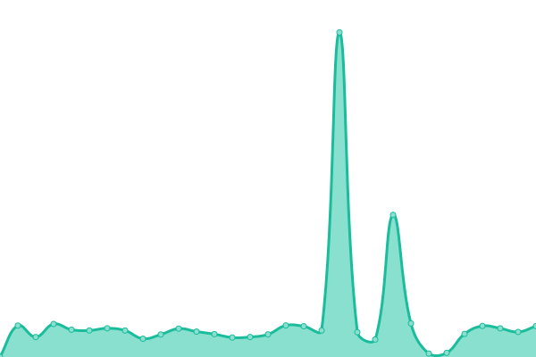
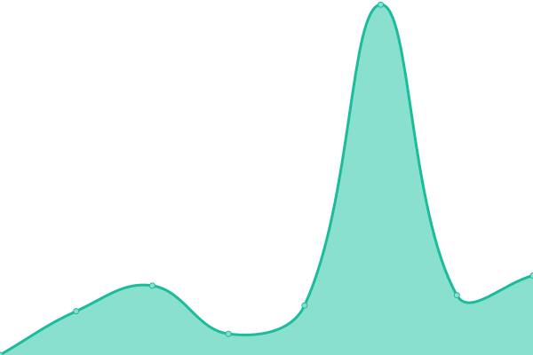

# [📈 Live Status](https://demo.upptime.js.org): <!--live status--> **🟧 Partial outage**

This repository contains the open-source uptime monitor and status page for [Sumit S. Chaure](https://github.com/Sumit-SC), powered by [Upptime](https://github.com/upptime/upptime).

With [Upptime](https://upptime.js.org), you can get your own unlimited and free uptime monitor and status page, powered entirely by a GitHub repository. We use [Issues](https://docs.github.com/en/issues) as [Incident Reports](https://github.com/Sumit-SC/uptime-webapp/issues), [Actions](https://docs.github.com/en/actions) as [Uptime Monitors](https://github.com/Sumit-SC/uptime-webapp/actions), and [Pages](https://pages.github.com/) for the [Status Page](https://demo.upptime.js.org).

---

<!--start: status pages-->
<!-- This summary is generated by Upptime (https://github.com/upptime/upptime) -->
<!-- Do not edit this manually, your changes will be overwritten -->
<!-- prettier-ignore -->
| URL | Status | History | Response Time | Uptime |
| --- | ------ | ------- | ------------- | ------ |
|  [Portfolio Page](https://sumit-sc.github.io) | 🟩 Up | [portfolio-page.yml](https://github.com/Sumit-SC/ping/commits/HEAD/history/portfolio-page.yml) | 

 77ms
     
 | 

<a href="https://status.sumit.indevs.in/history/portfolio-page">100.00%</a>
    

|  [Personal-Lab](http://www.colab.indevs.in) | 🟥 Down | [personal-lab.yml](https://github.com/Sumit-SC/ping/commits/HEAD/history/personal-lab.yml) | 

 292ms
     
 | 

<a href="https://status.sumit.indevs.in/history/personal-lab">0.00%</a>
    

|  [Portfolio Website](https://www.sumit.indevs.in) | 🟥 Down | [portfolio-website.yml](https://github.com/Sumit-SC/ping/commits/HEAD/history/portfolio-website.yml) | 

 453ms
     
 | 

<a href="https://status.sumit.indevs.in/history/portfolio-website">99.23%</a>
    

|  [Google](https://www.google.com) | 🟩 Up | [google.yml](https://github.com/Sumit-SC/ping/commits/HEAD/history/google.yml) | 

 87ms
     
 | 

<a href="https://status.sumit.indevs.in/history/google">100.00%</a>
    

|  [Wikipedia](https://en.wikipedia.org) | 🟩 Up | [wikipedia.yml](https://github.com/Sumit-SC/ping/commits/HEAD/history/wikipedia.yml) | 

 255ms
     
 | 

<a href="https://status.sumit.indevs.in/history/wikipedia">100.00%</a>
    

|  [Streamio](https://idx.theworkpc.com) | 🟥 Down | [streamio.yml](https://github.com/Sumit-SC/ping/commits/HEAD/history/streamio.yml) | 

 0ms
     
 | 

<a href="https://status.sumit.indevs.in/history/streamio">0.00%</a>
    

|  [Streamio V2](https://hardik.indevs.in) | 🟥 Down | [streamio-v2.yml](https://github.com/Sumit-SC/ping/commits/HEAD/history/streamio-v2.yml) | 

 1429ms
     
 | 

<a href="https://status.sumit.indevs.in/history/streamio-v2">59.59%</a>
    

<!--end: status pages-->

[**Visit My Status Website →**](http://sumit.indevs.in/ping)

[**Visit My Website Monitor →**](http://sumit-sc.github.io/ping)

[**Personal Server Status Page →**](https://status.telemetry.indevs.in)

[**Visit Upptimes Demo status website →**](https://demo.upptime.js.org) to [create](https://github.com/upptime/upptime) your own Upptime Monitor for free

---

# 📡 Runners Stack & CI-CD testing Metrics

<table>
<tr>

<td valign="top" width="50%">

## 🚀 Infra Alerts (Telegram)

| Workflow           | Status                                                                                                                                                                                 |
| ------------------ | -------------------------------------------------------------------------------------------------------------------------------------------------------------------------------------- |
| 📊 Infra Summary   |       |
| ⚡ Latency Monitor |           |
| 🚨 Incident Alerts |  |

</td>

<td valign="top" width="50%">

## ⚙️ Upptime Core Workers

| Workflow          | Status                                                                                                                                                                                                  |
| ----------------- | ------------------------------------------------------------------------------------------------------------------------------------------------------------------------------------------------------- |
| 🩺 Uptime Checks  |                     |
| ⚡ Status Ping    |  |
| 📈 Graph Engine   |                      |
| 🌐 Status Site    |           |
| 📝 Status Summary |                  |

</td>

</tr>
</table>

---

## 📄 License

- Powered by: [Upptime](https://github.com/upptime/upptime)
- Code: [MIT](./LICENSE) © [Anand Chowdhary](https://anandchowdhary.com), supported by [Pabio](https://pabio.com)
- Data in the `./history` & Tg Notification mertics in the `./observability`directory: [Open Database License](https://opendatacommons.org/licenses/odbl/1-0/)
